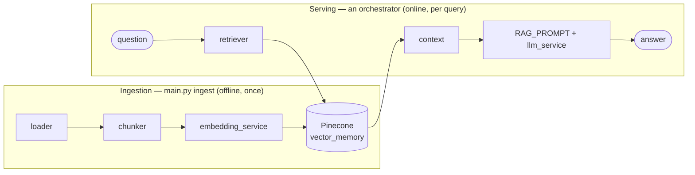
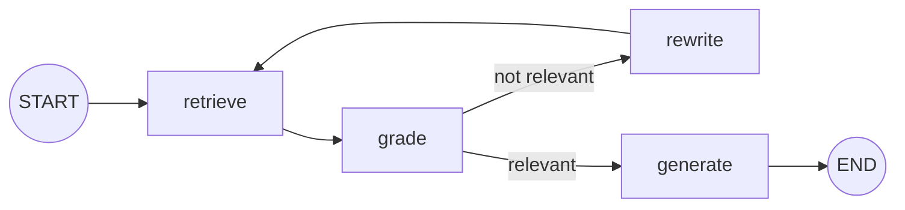

# Architecture

## RAG vs agentic — the distinction this layout is built on

The difference is **who controls the flow**:

- **RAG** is a *fixed pipeline*: your code always runs `retrieve → prompt →
  generate`. The LLM is called at one fixed spot; it does not decide what to do.
- **Agentic** is *model-driven*: the LLM is given tools and a goal and decides,
  in a loop, what to do next — when to retrieve, whether the result is good
  enough, when to retry, when it's done.

> Test: is the sequence of steps fixed in code (RAG) or decided by the model at
> runtime (agentic)?

Plain RAG is **not** agentic — but it's the core an agent uses. That's why this
project uses an agentic structure with RAG as the shared core: the **LangChain**
orchestrator runs a fixed `retrieve → generate`, while the **LangGraph**
orchestrator is **agentic** — it grades its own retrieval and rewrites the query
on a miss (see below). The structure leaves room to grow further (multi-source
retrieval, tool-calling, planning).

## The layout

Organized by **agent faculty** (the agentic convention), with the RAG pipeline
living inside it as the shared core:

```
shared core (used by every orchestrator)
  ingestion/  →  services/embedding_service  →  services/vector_store_service
   (load+chunk)        (embed)                      (Pinecone index)
                                                        │
                            memory/vector_memory  ◀─────┘   ("RAG embeddings")
                                   │
   services/llm_service · prompts/prompt_templates · utils/helpers
                                   │
        ┌──────────────────────────┴──────────────────────────┐
   orchestrators/  (the swap point — all share BaseOrchestrator)
   langchain · langgraph · crewai* · google_adk*      (*extension stubs)
        │
   agents/rag_agent  →  main.py / scripts/benchmark.py
```

## Data flow (shared by all orchestrators)



## The orchestrator contract (the extension point)

Every framework implements the same tiny interface, so they're swappable and
comparable:

```python
class BaseOrchestrator(ABC):
    name: str
    @abstractmethod
    def answer(self, question: str) -> Timing: ...
```

- **`langchain_orchestrator.py`** — `RAG_PROMPT | llm` piped after the retriever (fixed).
- **`langgraph_orchestrator.py`** — an **agentic** `StateGraph`: `retrieve → grade →`
  (relevant?) `generate`, else `rewrite → retrieve` (bounded by `agentic.max_retries`).
- **`crewai_orchestrator.py`, `google_adk_orchestrator.py`** — stubs that raise
  `NotImplementedError` with instructions.

### Adding a new orchestrator (CrewAI / Google ADK / …)

1. `uv add crewai` (or `google-adk`).
2. Implement `answer()` in the stub, reusing the shared core:
   ```python
   from memory.vector_memory import VectorMemory
   from services.llm_service import get_llm
   # build your crew/agent, retrieve via VectorMemory().search(q), return a Timing
   ```
3. Register it in `scripts/benchmark.py` and `main.py`'s orchestrator map.

Because it reuses the same `memory/` and `services/`, it's instantly comparable.

## LangChain vs LangGraph (the working pair)

Both call the *same* retriever and model, so raw latency is nearly identical —
retrieval and generation dominate; orchestration overhead is sub-millisecond. The
benchmark shows it; the decision is architectural:

| Dimension | LangChain (LCEL chain) | LangGraph (agentic) |
|-----------|------------------------|------------------------|
| Mental model | A pipeline: `a \| b \| c` | A state machine: nodes + edges |
| Best for | Linear, fixed flows | Branching, loops, retries, human-in-the-loop |
| Control flow | Straight through | Conditional edges, cycles |
| State | Passed along the pipe | Explicit shared `State` (TypedDict) |
| Persistence/memory | Bring your own | Built-in checkpointers + `thread_id` |

## Agentic RAG (implemented in the LangGraph orchestrator)

The LangGraph orchestrator is a self-correcting loop: it **grades** its own
retrieval and, on a weak result, **rewrites** the query and retrieves again
(bounded by `agentic.max_retries`). This is what a plain LCEL chain *cannot*
express. The `ask` command prints the path taken, e.g.
`retrieve -> grade:relevant -> generate`.



**Where it grows next** (from the 2026 agentic-RAG blueprint in
`docs/1782553002270.jpeg`): multi-source retrieval (BM25/SQL), a retrieval-
strategy selector, answer verification + citations, session/long-term memory,
and the CrewAI / Google ADK orchestrators.

See [setup.md](setup.md) for installation and run commands.
